# Osteosarcoma Data Visualization Project
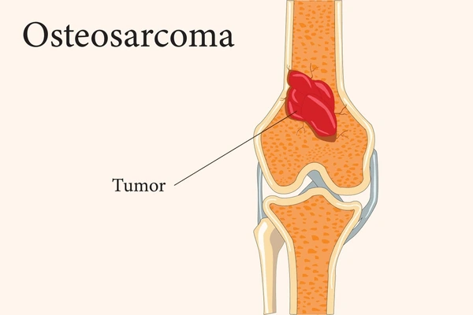 

### Project Overview
- This project explores clinical patterns and demographic insights in osteosarcoma patients from [cBioPortal](https://www.cbioportal.org/study/summary?id=os_target_gdc) to identify patterns in mortality, metastasis, tumor location, age at diagnosis, and ICD-10 classifications. 

### Tools Used
- **Plotly** for interactive charts
- **Pandas** for data wrangling
- **Dash** for web-based dashboard
- **Seaborn & Matplotlib** for static comparisons

---

### What Is the Use Case?
- Osteosarcoma is a rare but aggressive cancer, and understanding how demographic and clinical features correlate with outcomes can guide clinical research and healthcare policy. 
- This project aims to:
1. Uncover disparities (e.g., by sex, age, race).
2. Highlight diagnostic trends (e.g., metastasis or ICD-10 coding).
3. Provide clinicians and researchers with interactive tools for exploration.

---

### Target Audiance and User Workflow
- **Target audience**:
Medical researchers, oncologists, data analysts in healthcare, and public health professionals.

- **Workflow**:
Users can:
  1. Read insights directly from the notebook or README.
  2. Interact with a live dashboard to filter ICD-10 codes by sex.
  3. Export visuals for reporting or presentation purposes.

---
### Key Design decisions
- **ICD-10 Dashboard**: Implemented an interactive Dash app to enable user-driven filtering.
- **Visualization Choices**:
  - Bar charts for comparisons (sex, race, tumor site).
  - Pie charts for proportional diagnosis age.
  - Dashboard for real-time ICD-10 filtering.

### Challenges
- **Custom Age Grouping**: grouped ages ≤23 as individual integers and >23 as `'>24'`.
- **Data Cleaning**: Uppercased string columns to unify categories (e.g., 'Male' vs 'MALE'), and filtered missing values.

---

### Interpretation of Results
- **Sex & Race**: Mortality varies across race-sex combinations.
- **Metastasis**: Males are more frequently present with metastasis, which is strongly associated with higher mortality.
- **Tumor Site**: sites outside the limbs correlate with higher mortality.
- **Diagnosis Age**: Majority of diagnoses occur before 24; sex-based age patterns are visible.
- **ICD-10**: Some classifications are more frequent in one sex than another.

---

### Reflections and Possible Improvements
- **Interactivity**: The ICD-10 dashboard was a good starting point. Future versions could include filters for race, tumor site, or age.
- **Data Limitations**: Some features (like detailed treatment history or progression timelines) are not available in the dataset.
- **Export Options**: Adding buttons to export plots as images or CSVs would help end users.

---

## Questions & Visual Insights

### QUESTION 1 : Mortality Rate by Sex and Race
### Is there a racial disparity in mortality rates between male and female osteosarcoma patients?
> This analysis explores how mortality rates differ between **male and female osteosarcoma patients** across various **racial groups**

---

### Steps

1. **Selected Relevant Columns**:  
   - `SEX`: Patient’s sex (male or female)  
   - `RACE`: Reported racial background of the patient  
   - `VITAL_STATUS`: Whether the patient was alive or dead  

2. **Data Cleaning**:
   - Removed any rows with missing values in these columns.
   - Converted all text to uppercase to ensure consistent grouping.

---

### Mortality Rate by Sex and Race

Grouped the data by `RACE` and `SEX`, then used `value_counts(normalize=True)` to calculate the proportion of patients who  **died** in each group.

- Filtered to include only `"DEAD"` values, so the chart shows **true mortality rates**.
- **X-axis**: Race categories  
- **Y-axis**: Mortality rate (as a percentage)  
- **Bars**: Grouped by sex (male vs female)

> This visualization highlights whether certain racial groups and sexes have a higher likelihood of mortality from osteosarcoma.

### Chart Preview

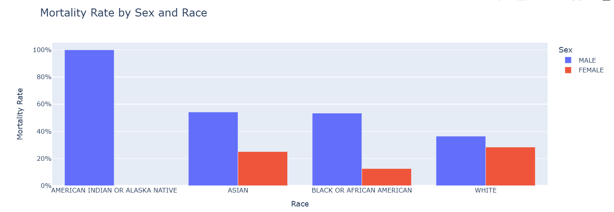 
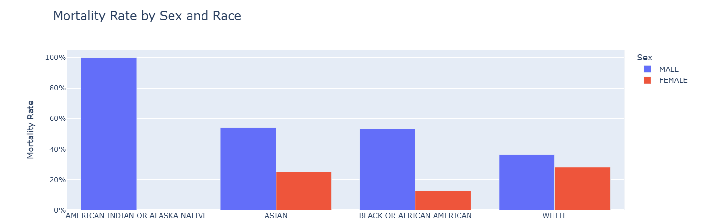

### QUESTION 2: Metastasis at Diagnosis based on Sex and Its Impact on Mortality
### Are males more likely than females to present with metastasis at diagnosis and does this affect survival?

> This analysis explores whether there are differences in the presence of metastasis at the time of diagnosis between male and female osteosarcoma patients and how metastasis affects mortality outcomes.

---
### Steps

1. **Selected Relevant Columns**:  
   - `SEX`: Patient’s sex (male or female)
   - `METASTASIS_AT_DIAGNOSIS`: Whether metastases were detected at diagnosis  
   - `VITAL_STATUS`: Whether the patient was alive or dead

2. **Data Cleaning**:
   - Removed any rows with missing values in these columns.
   - Converted text fields to uppercase to avoid grouping inconsistencies.

---

### Firstly: Metastasis at Diagnosis Based on Sex

grouped patients by `SEX` and `METASTASIS_AT_DIAGNOSIS` to count how many in each group had or did not have metastasis at diagnosis.

- **X-axis**: Metastasis status ("YES" or "NO")
- **Y-axis**: Number of patients
- **Bars**: Grouped by sex (male or female)

> This visualization helps identify which sex is more likely to present with metastasis at diagnosis.

---

### Secondly: Mortality Rate Based on Metastasis Status

analyzed how the presence of metastasis at diagnosis correlates with mortality:

- Used `value_counts(normalize=True)` to calculate the **percentage of patients who died** in each metastasis group.
- Filtered to include only the `"DEAD"` status to reflect true mortality rate.

- **X-axis**: Metastasis at diagnosis (YES/NO)
- **Y-axis**: Mortality rate (%)

> This chart reveals whether patients with metastasis at diagnosis had significantly higher mortality.

---

> These visualizations work together to reveal both demographic patterns and clinical outcomes related to metastasis in osteosarcoma.
### Chart Preview

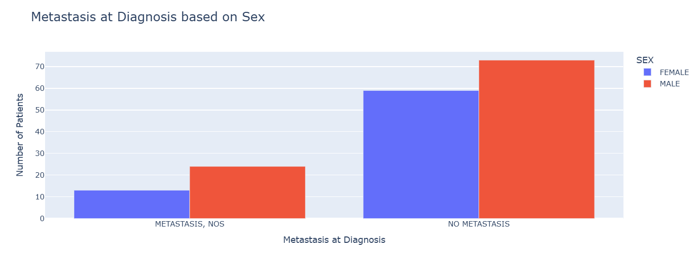 
 
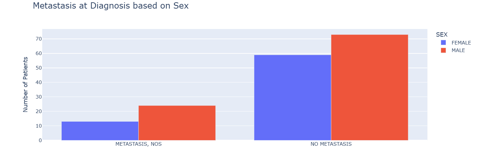
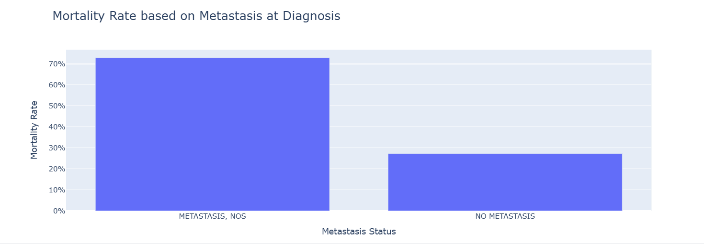

### QUESTION 3: Tumor Site Distribution and Associated Mortality Rates

> Do tumor locations differ significantly between male and female patients and are some sites linked to worse outcomes?
> This analysis explores wether **tumor location (primary site)** varies between males and females, and how tumor site may relate to **mortality outcomes**.

1. **Selected Columns**:  
   - `SEX`: Patient’s sex (male or female)
   - `PRIMARY_SITE_PATIENT`: Anatomical site of the tumor  
   - `VITAL_STATUS`: Whether the patient was alive or dead

2. **Data Cleaning**:
   - Dropped rows with missing values
   - Standardized all text to uppercase for consistency in grouping

---

### Firstly: Tumor Site Distribution Based on Sex

counted how many patients had tumors in each site, grouped by sex.

- **X-axis**: Tumor site  
- **Y-axis**: Number of patients  
- **Bars**: Colored by sex (male vs female)

> This visualization reveals whether certain tumor sites are more common in males or females.

---

### Secondly: Overall Mortality Rate Based on Tumor Site

Here, we examined the **percentage of dead patients only** for each tumor site (regardless of sex).

- Used `value_counts(normalize=True)` to calculate the proportion of deaths at each site
- Filtered only the `"DEAD"` values

- **X-axis**: Tumor site  
- **Y-axis**: Mortality rate (in percentage)  

**Note**: The percentages shown in this chart represent the proportion of dead patients **relative to the total number of patients (dead and alive)** at each tumor site.

> This visualization is useful for identifying tumor locations associated with higher risk.

---

### Thirdly: Mortality Rate based on Tumor Site and Sex

Finally, analyzed mortality rates **based on both tumor site and sex**.

- Used `value_counts(normalize=True)` to calculate the proportion of deaths at each site
- Filtered by both `SEX` and `PRIMARY_SITE_PATIENT`

- **X-axis**: Tumor site  
- **Y-axis**: Mortality rate (%)  
- **Bars**: Colored by sex

**Note**: The percentages shown in this chart represent the proportion of dead patients **relative to the total number of patients (dead and alive)** at each tumor site.

>  This visualization is useful for identifying whether male or female patients have worse outcomes depending on tumor location.

---

> The three visualization provide a comprehensive view of how tumor site and sex intersect with survival in osteosarcoma patients.

### Chart Preview

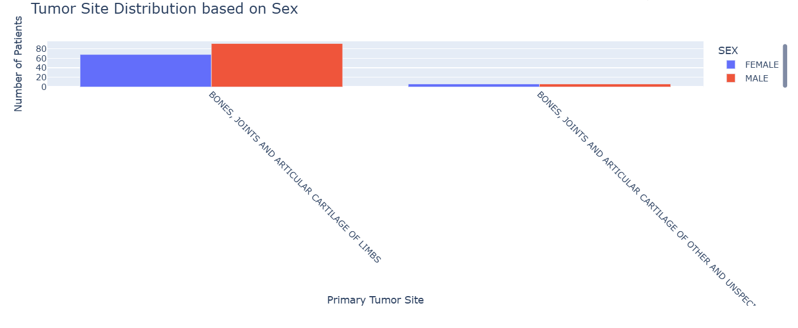 
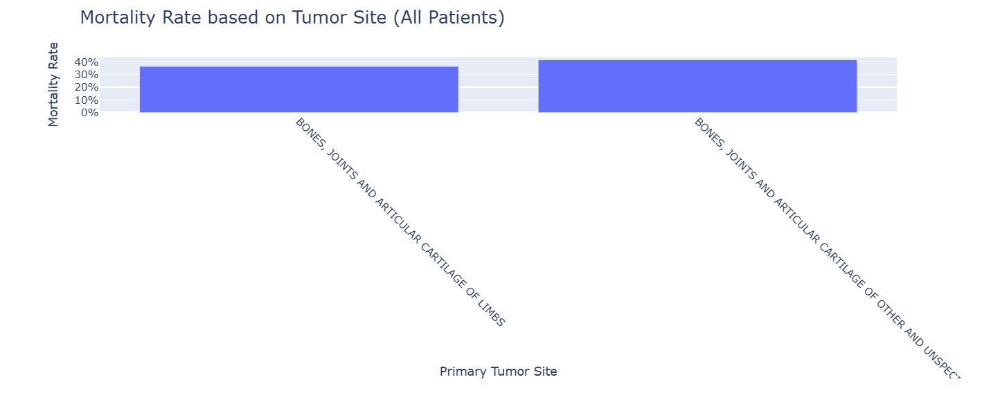 
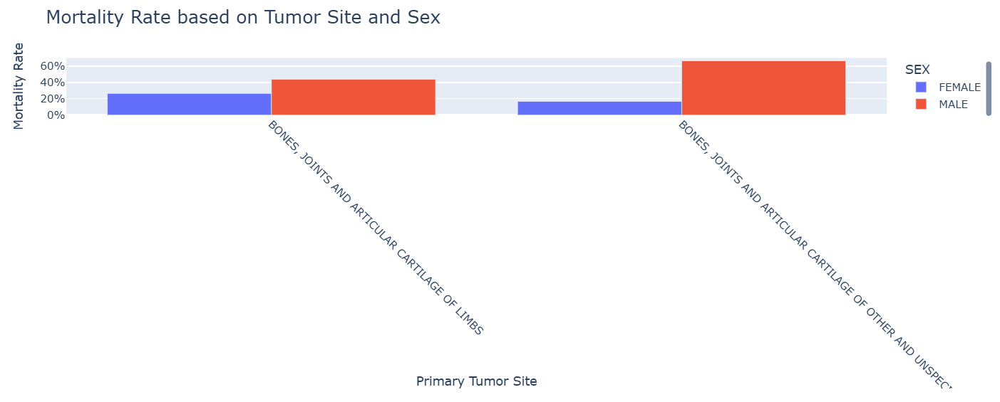 
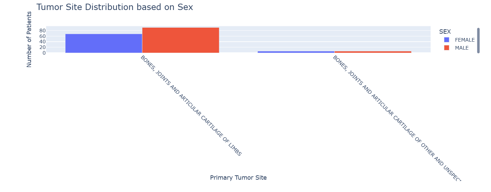
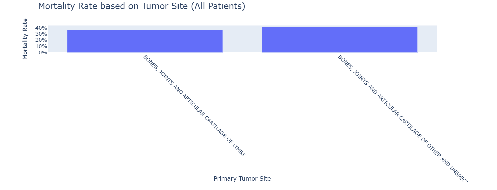
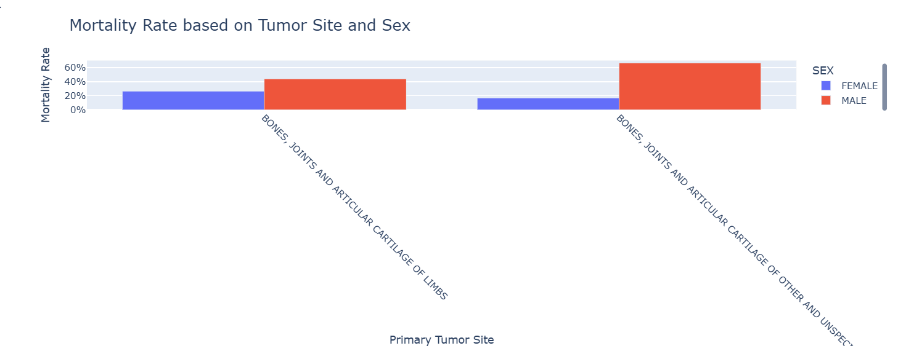

### QUESTION 4: Diagnosis Age Distribution between Males and Females
Do males and females get diagnosed at different ages and does age at diagnosis affect outcome?

> This analysis explores whether there are differences in **age at diagnosis** between male and female osteosarcoma patients, and how age is distributed within each sex group.

---

### Steps

1. **Selected Relevant Columns**:  
   - `SEX`: Patient’s sex (male or female)  
   - `AGE`: Age at diagnosis of osteosarcoma

2. **Data Cleaning**:
   - Removed any rows with missing values in these columns.
   - Converted text fields to uppercase to ensure consistency.
   - Age groups were created by mapping:
     - `AGE > (or) = 23`: exact integer (e.g., 12, 15, 23)
     - `AGE > 23`: grouped into a single category `'>24'`

---

### Firstly: Age Distribution based on Sex (Grouped Bar Chart)

Patients were grouped by `SEX` and `AGE_GROUP_COMBINED` to compare the number of diagnoses at each age level.

- **X-axis**: Age group 
- **Y-axis**: Number of patients  
- **Bars**: Grouped by sex (male or female)

> This visualization shows whether male or female are diagnosed earlier or more frequently at a specific ages.

---

### Secondly: Age Distribution based on Sex (Pie Charts)

To better understand how age is distributed **within** each sex group, the **percentage of each age group** relative to all patients of the same sex was calculated
 Created two pie charts:
  - One for **female** patients
  - One for **male** patients
- **Labels**: Age groups  
- **Values**: Percentage of patients in each group

> These pie charts reveal internal age distribution patterns for each sex and highlight the most common ages at diagnosis.

---

> These visualizations show both **absolute counts** and **relative proportions** of osteosarcoma diagnoses by age and sex.

### Chart Preview

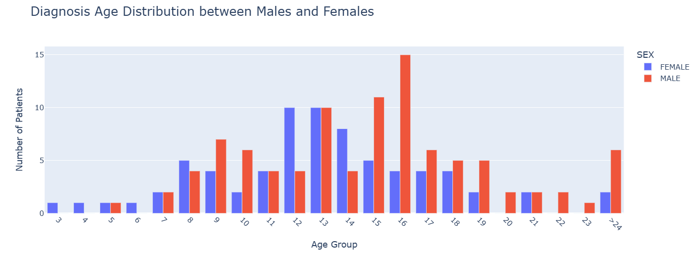 
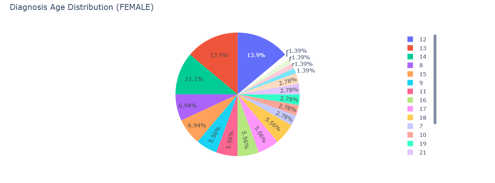 
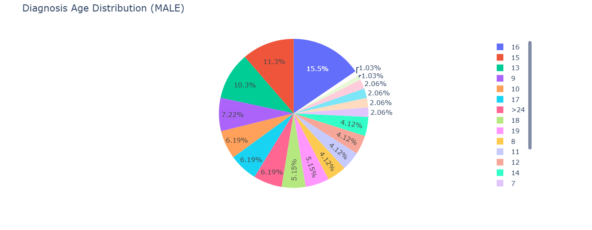 
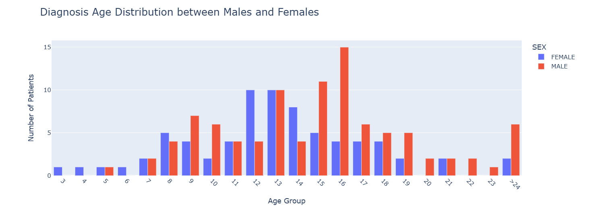
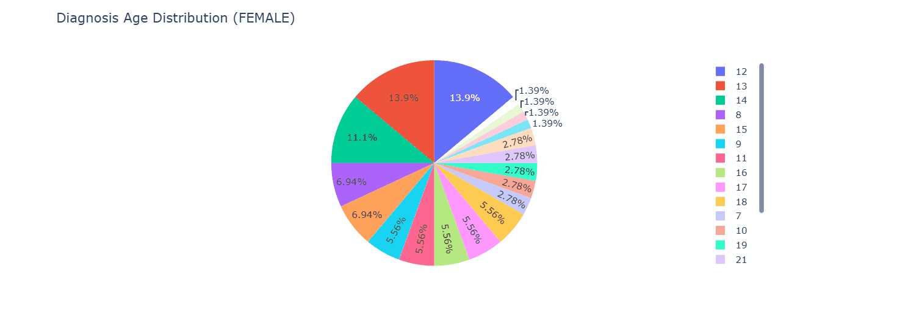
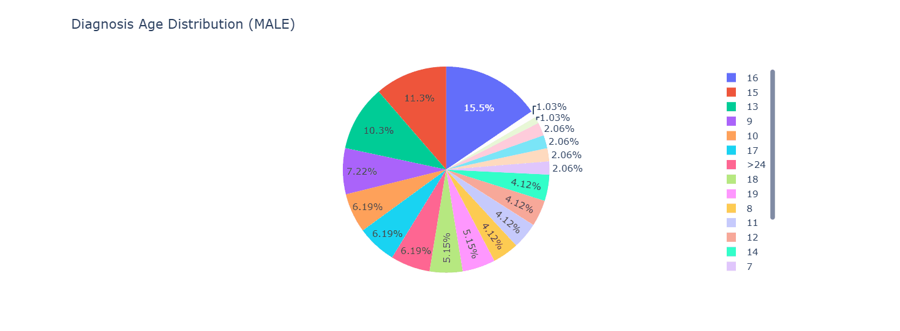

### Question 5: ICD-10 Classification between Male and Female
How Do ICD-10 Diagnostic Classifications Differ Between Male and Female Osteosarcoma Patients?
> This dashboard explores whether there are differences in teh distibution of **ICD-10 classifications** between male and female osteosarcoma patients using an interactive web interface.

---

### Steps

1. **Selected Relevant Columns**:  
   - `SEX`: Patient’s sex (male or female)  
   - `ICD_10`: ICD-10 diagnostic code assigned to each patient

2. **Data Cleaning**:
   - Removed any rows with missing values in these columns using `.dropna()`
   - Standardized the text fields by converting all values to uppercase to avoid grouping mismatches

---

### Dashboard Functionality

A dropdown menu allows users to choose between:
- `"All"`: Shows ICD-10 classifications for both sexes
- `"Male"`: Displays only data for male patients
- `"Female"`: Displays only data for female patients

A grouped **bar chart** is updated based on the selected option.

- **X-axis**: ICD-10 classification codes  
- **Y-axis**: Number of patients per ICD-10 code  
- **Bars**: Colored by sex (if viewing both sexes)

> This dashboard provides an interactive way to explore diagnostic code patterns across male and female osteosarcoma patients.

---

> This visualization highlights how diagnostic classifications are distributed across both males and females and offers a flexible tool to filter and compare patients using ICD-10 patterns.

### Chart Preview

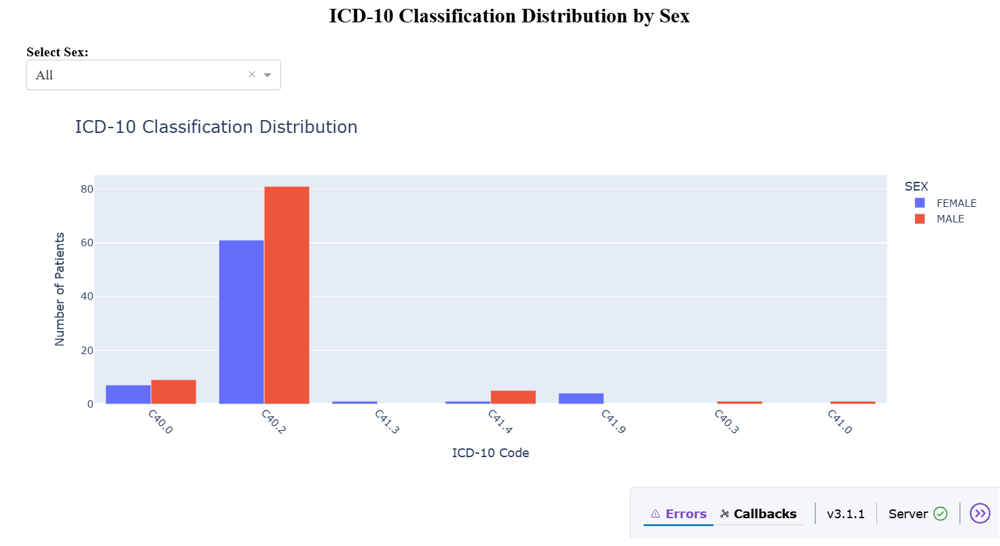 
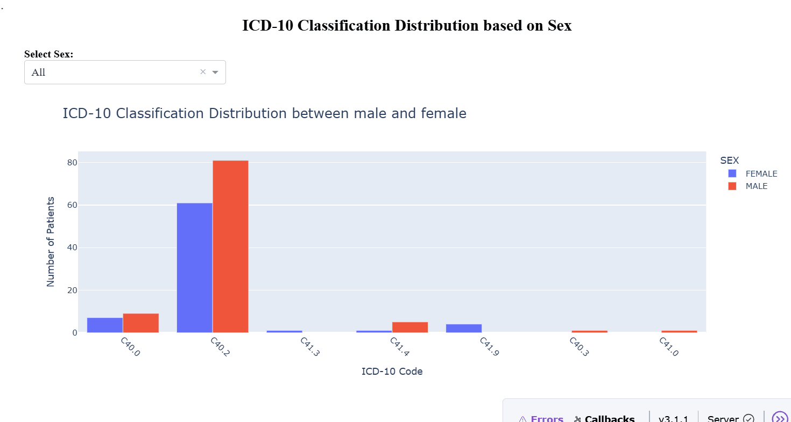
---

---

## Structure
- `Osteocarcinoma.ipynb`: Main analysis and visualization notebook.
- `README.md`: Project summary and explanation.
- `data_clinical_patient.txt`: Clinical dataset from cBioPortal.

---

### References

1. cBioPortal. Osteosarcoma (TARGET, GDC). Available at: [https://www.cbioportal.org/study/summary?id=os_target_gdc](https://www.cbioportal.org/study/summary?id=os_target_gdc) (Accessed: 4 July 2025).

2. OpenAI (2025). ChatGPT – AI Assistant for Data Analysis. Available at: https://chat.openai.com/ (Accessed: 4 July 2025).

### Versioning  
Notebook and insights by **Dani Sharl Ajami**.  
- **Version:** 1.1.1  
- **Date:** 2025-07-04 